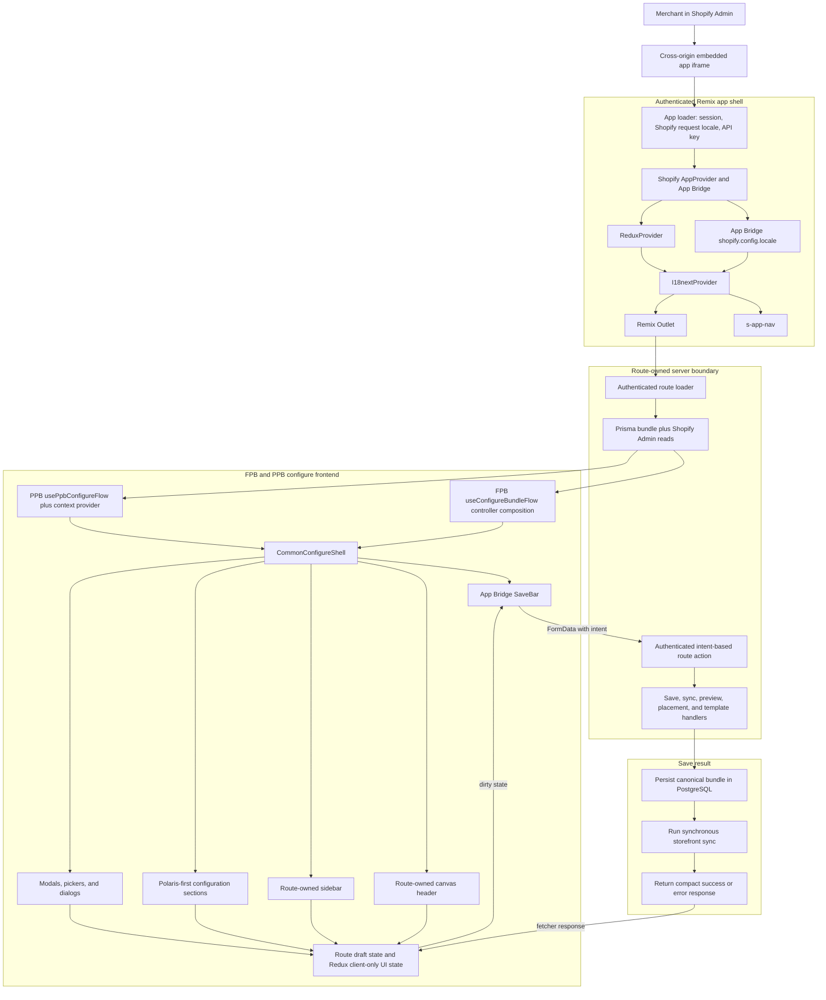

# Admin UI Frontend Architecture

## Ownership boundaries

- Shopify owns each Admin user's locale preference. The initial request `locale` parameter and client-side `shopify.config.locale` select the matching i18next and Polaris resources; the app does not persist or render a separate locale preference.
- The app shell owns authentication bootstrap, App Bridge, lazy locale-resource loading, Redux, localization, and global navigation.
- All embedded Admin routes, shared components, banners, modals, form labels, and accessibility labels consume the common Admin catalogs. Unsupported Shopify locales fall back to English; Simplified Chinese resolves from `zh`, `zh-Hans`, and `zh-CN`.
- Remix loaders/actions remain the route data boundary; Redux stores only client-side Admin state and selected standalone client calls.
- FPB and PPB keep separate route URLs, loaders, actions, save handlers, and storefront sync contracts.
- `CommonConfigureShell` owns shared shell composition only. FPB and PPB flows inject their own header, sidebar, sections, overlays, draft logic, and save semantics.
- Admin components use Polaris web components first; custom HTML is reserved for documented gaps such as the configure shell grid and specialized overlays.
