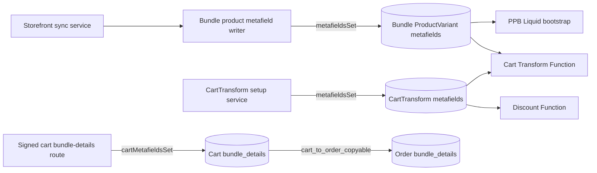

# Metafield Design and Consumption

## Ownership and lifecycle

| Owner | Namespace/key | Primary writer | Primary consumer |
|---|---|---|---|
| Bundle ProductVariant | `$app.bundle_ui_config` | Bundle product metafield writer | PPB Liquid bootstrap |
| Bundle ProductVariant | `$app.component_reference`, `$app.component_quantities` | Bundle product metafield writer | Cart Transform |
| Bundle ProductVariant | `$app.price_adjustment`, `$app.component_pricing` | Bundle product metafield writer | Cart Transform |
| CartTransform | `$app.runtime_configuration` | CartTransform setup service | Cart Transform secret and cart-line messaging |
| Discount | `$app.runtime_token_secret` | Discount setup service | Discount Function |
| Cart | `$app.bundle_details` | Signed app-proxy route | Shopify cart-to-order copy pipeline |
| Order | `$app.bundle_details` | Shopify cart-to-order copy | Order surfaces and downstream integrations |

FPB configuration is supplied by the app-proxy document and its bundle API fallback. There is no Page metafield writer or Page-owned FPB runtime configuration.
