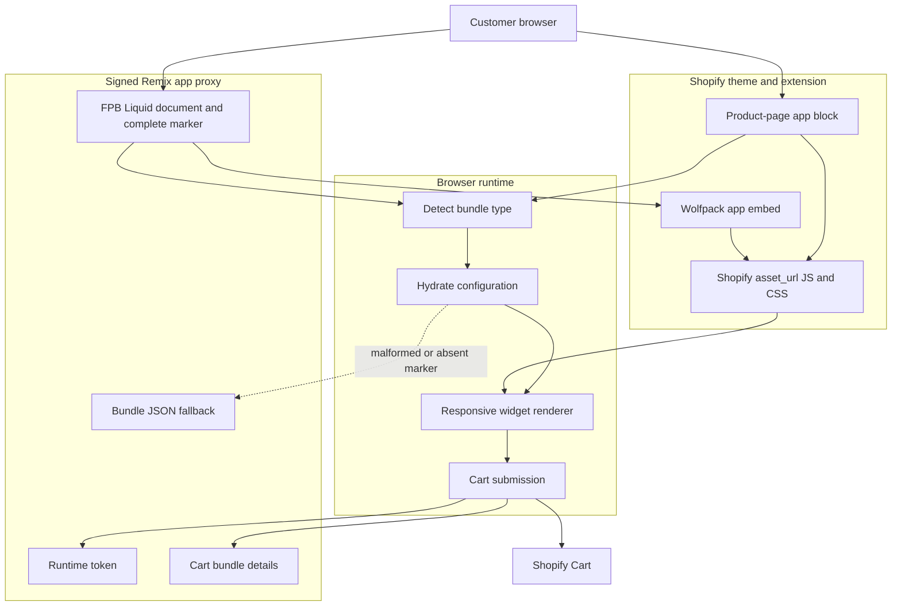

# Storefront Frontend Architecture

## Runtime boundaries

- FPB is hosted only by the signed app-proxy Liquid document; it does not require a Shopify Page or Page block.
- The FPB app-proxy marker contains the complete current configuration. The bundle JSON API is the existing fallback when that marker is absent or malformed.
- PPB remains product-hosted and merchant-positioned through `bundle-product-page.liquid`.
- The app embed and product-page block load deployable JS and CSS through Shopify `asset_url`.
- Browser selection state is storefront-local. Cart authorization is requested immediately before adding lines.
